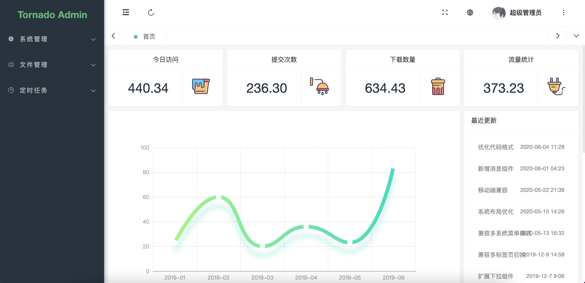

<div align="center">
<br/>
<br/>
  <h1 align="center">
    Tornado Admin
  </h1>
  <h4 align="center">
    基于Tornado的ORM管理后台
  </h4>

</div>


<div style="color:red">
重要说明:
项目使用的UI来源 <a href="https://gitee.com/pear-admin/pear-admin-flask">【Pear Admin Flask】</a>，感谢原作者分享 
</div>


<div align="center">
  
</div>

#### 项目简介
>Tornado Admin 基于 Tornado 的后台管理系统，拥抱应用广泛的python语言，通过使用本系统，即可快速构建你的功能业务
>
>项目旨在为python开发者提供一个后台管理系统的模板，成为您构建信息管理系统，物联网后台....等等应用时灵活，简单的工具
>
>众人拾柴火焰高，欢迎pythoner参与项目~

####  内置功能

- [x] 用户管理：用户是系统操作者，该功能主要完成系统用户配置。
- [x] 权限管理：配置系统菜单，操作权限，按钮权限标识等。
- [x] 角色管理：角色菜单权限分配。
- [x] 操作日志：系统正常操作日志记录和查询；系统异常信息日志记录和查询。
- [x] 登录日志：系统登录日志记录查询包含登录异常。
- [x] 服务监控：监视当前系统CPU、内存、磁盘、python版本,运行时长等相关信息。
- [x] 文件上传:   图片上传示例
- [x] 定时任务:   简单的定时任务
- [ ] 代码生成:   构想中....

####  项目结构

```
Tornado Admin
├─applications  # 应用
│  ├─configs  # 配置文件
│  │  ├─ common.py  # 普通配置
│  │  └─ config.py  # 配置文件对象
│  ├─extensions  # 注册插件
│  ├─models  # 数据模型
│  ├─static  # 静态资源文件
│  ├─templates  # 静态模板文件
│  └─views  # 视图部分
│     ├─admin  # 后台管理视图模块
│     └─index  # 前台视图模块
├─docs  # 文档说明（占坑）
├─migrations  # 迁移文件记录
├─requirement  # 依赖文件
├─test # 测试文件夹（占坑）
└─.env # 项目的配置文件

```


#### 项目安装

```bash
# 下 载
git clone https://gitee.com/meadhu/tornadoadmin.git

# 安 装
pip install -r requirements.txt

# 配 置
.env

```

#### 修改配置

```python
.env
# MySql配置信息
MYSQL_HOST=127.0.0.1
MYSQL_PORT=3306
MYSQL_DATABASE=PearAdminFlask
MYSQL_USERNAME=root
MYSQL_PASSWORD=root

# Redis 配置
REDIS_HOST=127.0.0.1
REDIS_PORT=6379

# 密钥配置
SECRET_KEY='pear-admin-flask'

# 邮箱配置
MAIL_SERVER='smtp.qq.com'
MAIL_USERNAME='123@qq.com'
MAIL_PASSWORD='XXXXX' # 生成的授权码
```

#### Venv 安装

```bash
python -m venv venv
```

#### 运行项目

```bash
# 初 始 化 数 据 库

python app.py init
```

执行 python app.py 命令启动项目

#### 命令行生成新模块的CRUD

```bash
# 示例
python app.py crud <表名>
```

#### 预览项目
