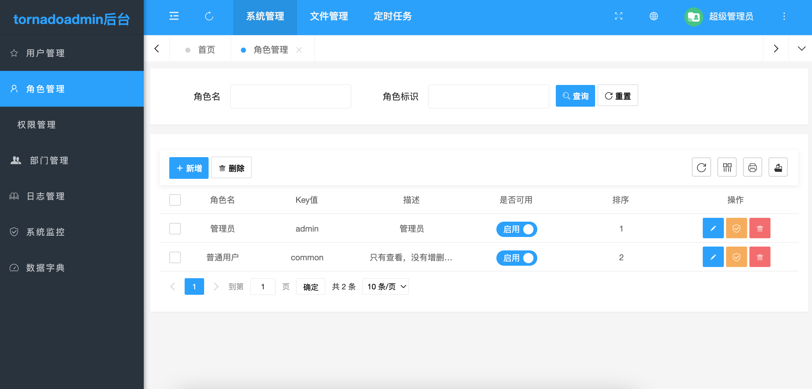
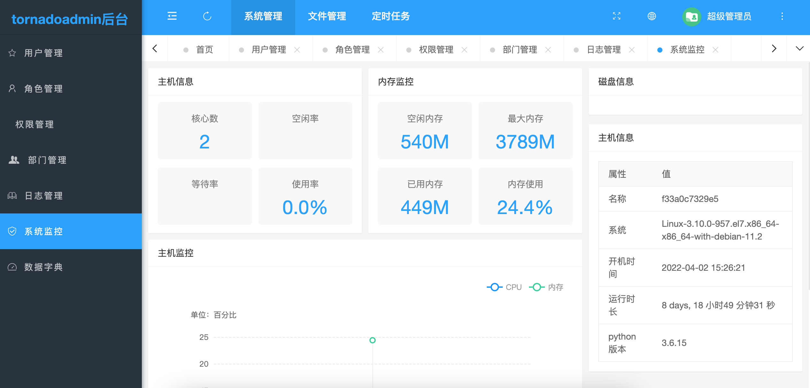

<div align="center">
<br/>
<br/>
  <h1 align="center">
    Tornado Admin
  </h1>
  <h4 align="center">
    基于Tornado的ORM管理后台
  </h4>

</div>


<div style="color:red">
重要说明:
项目使用的UI来源 <a href="https://gitee.com/pear-admin/pear-admin-flask">【Pear Admin Flask】</a>，感谢原作者分享 
</div>


<div align="center">
  
</div>

#### 项目简介
>Tornado Admin 基于 Tornado 的后台管理系统，拥抱应用广泛的python语言，通过使用本系统，即可快速构建你的功能业务
>
>项目旨在为python开发者提供一个后台管理系统的模板，成为您构建信息管理系统，物联网后台....等等应用时灵活，简单的工具
>
>众人拾柴火焰高，欢迎pythoner参与项目~

####  内置功能

- [x] 用户管理：用户是系统操作者，该功能主要完成系统用户配置。
- [x] 权限管理：配置系统菜单，操作权限，按钮权限标识等。
- [x] 角色管理：角色菜单权限分配。
- [x] 操作日志：系统正常操作日志记录和查询；系统异常信息日志记录和查询。
- [x] 登录日志：系统登录日志记录查询包含登录异常。
- [x] 服务监控：监视当前系统CPU、内存、磁盘、python版本,运行时长等相关信息。
- [x] 文件上传:   图片上传示例
- [x] 定时任务:   简单的定时任务
- [x] 代码生成:   根据表生成model, 根据表生成增删改查后端代码和前台页面

####  项目结构

```
Tornado Admin
├─common  # 公共类
│  ├─ __init__.py  # 项目启动时, 初始化数据库连接
│  ├─ ApsChedulerHelper.py  # 定时任务类
│  ├─ DbHelper.py  # 数据库连接公共类
│  └─ HttpHelper.py  # Http请求公共类
├─config  # 配置文件
│  └─ __init__.py
├─docker_data
├─docs  # 文档
├─handler  # 控制器层
│  ├─ __init__.py
│  ├─ IndexHandler.py  # 前台首页
│  ├─ HomeHandler.py   # 后台首页
│  ├─ AuthHandler.py   # 前台登录相关
│  ├─ BaseHandler.py   # 公共类
│  ├─ DeptHandler.py   # 部门管理
│  ├─ DictHandler.py   # 字典管理
│  ├─ FileHandler.py   # 文件管理
│  ├─ LogHandler.py    # 日志管理
│  ├─ MonitorHandler.py  # 监控管理
│  ├─ PowerHandler.py  # 权限管理
│  ├─ RoleHandler.py   # 角色管理
│  ├─ TaskHandler.py   # 任务管理
│  └─ UserHandler.py   # 用户管理
├─models
├─static  # 静态文件
├─templates  # 模板
├─app.py  # 主入口
├─docker-compose.yml
├─Dockerfile
├─README.md
├─requirements.txt
└─start.sh
```

#### 本地开发环境搭建

```bash
# 下 载
git clone https://gitee.com/meadhu/tornadoadmin.git
# 安 装
pip install -r requirements.txt -i https://pypi.douban.com/simple
# 修改数据库连接信息 【不需要提前创建数据库, 在第一次运行时会自动创建并导入初始化数据】
config/__init__.py
# 执行命令启动项目 【项目第一次启动, 会自动创建数据库, 并导入初始化数据】
python run.py
# 访问  默认后台账号密码  admin  admin
http://localhost:3000/
```

#### 线上docker部署
```shell
# 下 载
git clone https://gitee.com/meadhu/tornadoadmin.git
# 进入项目目录
cd tornadoadmin
# docker compose 构建项目镜像
docker-compose build
# docker-compose 运行项目
docker-compose up -d
# 访问
http://XXXX:3000/
```

#### Venv 安装

```bash
python -m venv venv
```

#### 命令行工具

```bash
# 通过表名, 反向生成Model
python app.py gen_model <表名>
# 通过表名，生成CRUD页面和功能（前提是已经生成了Model）
python app.py gen_crud <表名>
# 在 /app.py 中, 添加路由
```

#### 代码生成示例
```shell
# 1. 创建表
DROP TABLE IF EXISTS `admin_project`;
CREATE TABLE `admin_project`  (
  `id` int(11) NOT NULL AUTO_INCREMENT COMMENT 'ID',
  `name` varchar(255) CHARACTER SET utf8 COLLATE utf8_unicode_ci NULL DEFAULT NULL COMMENT '项目名称',
  `code` varchar(255) CHARACTER SET utf8 COLLATE utf8_unicode_ci NULL DEFAULT NULL COMMENT '项目标识',
  `remark` varchar(255) CHARACTER SET utf8 COLLATE utf8_unicode_ci NULL DEFAULT NULL COMMENT '备注',
  `details` varchar(255) CHARACTER SET utf8 COLLATE utf8_unicode_ci NULL DEFAULT NULL COMMENT '详情',
  `sort` int(11) NULL DEFAULT NULL COMMENT '排序',
  `create_at` datetime(0) NULL DEFAULT NULL COMMENT '创建时间',
  `update_at` datetime(0) NULL DEFAULT NULL COMMENT '更新时间',
  `enable` int(11) NULL DEFAULT NULL COMMENT '是否启用',
  PRIMARY KEY (`id`) USING BTREE
) ENGINE = InnoDB AUTO_INCREMENT = 1 CHARACTER SET = utf8 COLLATE = utf8_unicode_ci ROW_FORMAT = DYNAMIC;
INSERT INTO `admin_project` VALUES (1, '示例项目一', 'proj_code_1', '这是示例项目一的备注信息', '这是示例项目一的详情信息', 10, NULL, NULL, 1);
INSERT INTO `admin_project` VALUES (2, '示例项目2', 'proj_code_2', '这是示例项目2的备注信息', '这是示例项目2的详情信息', 20, NULL, NULL, 1);
INSERT INTO `admin_project` VALUES (3, '示例项目3', 'proj_code_3', '这是示例项目3的备注信息', '这是示例项目3的详情信息', 30, NULL, NULL, 0);
SELECT * from `admin_project` ORDER BY id DESC LIMIT 10;
```

<div align="center">
  
</div>

```shell
# 2. 生成 model
python app.py gen_model admin_project
```

<div align="center">
  
  
</div>

```shell
# 3. 生成 后端功能和前端页面
python app.py gen_crud admin_project
```

<div align="center">
  
  
</div>

```shell
# 4. 修改 app.py 中，路由配置
```
<div align="center">
  
</div>

```shell
# 5. 启动项目，访问 http://localhost:3000/admin/project/main
```
<div align="center">
  
</div>

#### 预览项目

<div align="center">
  
  
  
  
  
  
</div>

```shell
# 分页代码  https://github.com/wizeline/sqlalchemy-pagination
from sqlalchemy_pagination import paginate
page = paginate(session.query(User), 1, 25)
# The pagination objects has the following attributes
#items: The items of the current page base on the query
#total: Total number of items
#pages: Total number of pages
#has_next: Boolean indication wether there are more pages to fetch
#has_previous: Boolean indicating wether there are previous pages
#next_page: Next page number or None if the current page is the last one
#previous_page: Previous page number or None if the current page is the last one
```